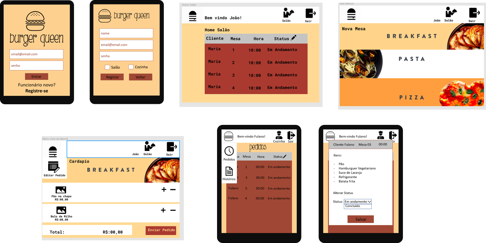

<p align="center">

</p>

<h1 align="center">Burger Queen</h1>

## Índice

- [1. Apresentação](#1-apresentacao)
- [2. Resumo do projeto](#2-resumo-do-projeto)
- [3. Planejamento](#3-planejamento)
- [4. Funcionalidades](#4-funcionalidades)
- [5. Implementações Futuras](#5-implementações-futuras)
- [6. Montagem do ambiente de desenvolvimento](#6-montagem-do-ambiente-de-desenvolvimento)

## 1. Apresentação

A aplicação consiste em um sistema, para gerenciamento de pedidos de um fast food. Foi desenvolvida em _JavaScript(ES6+)_, _HTML5_, [StyledComponents](https://styled-components.com/) para estilização, [Firebase](https://firebase.google.com/) Hosting e Firestore para hospedagem e banco de dados e [React JS](https://pt-br.reactjs.org/docs/getting-started.html).

A estratégia de desenvolvimento usada foi pair programming, code review e sub-divisão das histórias de usuário.

## 2. Resumo do projeto

A página da aplicação pode ser acessada atraves do Link: [Burger Queen](https://burguer-queen-6637b.web.app/) :crown:

Burger Queen é uma aplicação de serviço, desenvolvida para um restaurante fast food com funcionamento 24 horas.
O objetivo da aplicação, é viabilizar um sitema que possa auxiliar no recebimento e gerenciamento de pedidos, permitindo maior demanda.

As **caraterísticas técnicas** da aplicação são:

- É uma Single-Page Application `SPA` - e foi implementado um sistema de rotas com uso de biblioteca [React Router Dom](https://reactrouter.com/web/guides/quick-start) para trocar entre telas de maneira dinâmica.

- Foi desenhada e desenvolvida com enfoque para `tablet` , e apresenta design responsivo para mobile e desktop.

- Permite a persistência de dados - a estrutura de dados foi desenhada de forma à consultá-los, atualizá-los, modificá-los e eliminá-los segundo os requerimentos do usuário. Para isto, foi utilizado `Firestore` do `Firebase`

## 3. Planejamento

Para guiar o nosso planejamento, desenvolvemos um protótipo, de baixa fidelidade para o layout da tela, com base nas funcionalidades solicitadas e na experiência do usuário.

<p align="center">

</p>

Foi utilizada a ferramenta trello, para execução do planejamento.

## 4. Funcionalidades

##### Na Burger Queen, é possível:

- Register Page/ Login Page:

  > - Criar sua conta, com email e senha ao clicar no botão _**"Registre-se"**_, sendo redirecionado para uma pagina de registro no primeiro acesso.
  > - Ao logar, será direcionado para setor correspondente ao cargo informado no momento do registro.

- Lounge Page:

  > - Status:  
  >   Vizualizar todos os pedidos, seus status e detalhes por ordem de entrada.  
  >   Alterar status do pedido para _**Entregue**_.
  > - Nova Mesa:  
  >   Adicionar nome e numero da mesa do cliente e acessar os menus.
  > - Menus:  
  >   Navegar entre os menus, adicionar e remover itens, vizualizar resumo e valor total, enviar o pedido para cozinha.

- Kitchen Page:

  > - Pedidos:  
  >   Vizualizar todos os pedidos, seus status e detalhes por ordem de entrada.  
  >   Alterar status do pedido para _**Concluído**_
  > - Histórico:  
  >   Vizualizar pedidos concluídos e entregues.  
  >   Vizualizar detalhes como, hora de entrada, tempo de preparo, nome do garçom e do cozinheiro resposavél, informações do pedido e do cliente.

## 5. Implementações Futuras

- Limitar visualização de pedidos nas telas de cozinha e salão em 10 e adicionar botão de "ver mais" que aparece quando ultrapassar esse limite;
- Aprimorar testes para cobrir 100% dos componentes;
- Refatoração do código e do CSS;
- Inserir campo de observação no resumo do pedido;
- Inserir imagens nos itens do Menu.

## 6. Montagem do ambiente de desenvolvimento

<p align="center">
 
</p>

> :warning: Será necessária a utilização:

- [Firebase](https://firebase.google.com/products/dynamic-links?gclid=EAIaIQobChMIo9Krk6-W6gIVARKRCh26pgTCEAAYASABEgLr-fD_BwE). :fire::fire::fire:

- [React JS](https://pt-br.reactjs.org/docs/getting-started.html).

- [Node.js](https://nodejs.org/) que contém o [npm](https://docs.npmjs.com/) para instalação das dependências.

* [Clone](https://help.github.com/articles/cloning-a-repository/) o projeto na sua máquina executando o seguinte comando no seu terminal:

```sh
git clone git@github.com:Burger-Queen-Laboratoria/SAP004-burger-queen.git
```

- Instale as dependências do projeto com o comando:

```sh
npm install
```

- Firebase Config

  :warning: Para inicialização do firebase, será necessário um arquivo _**init-config.js**_ na pasta _**firebase**_ contendo as informações de autenticação da sua database, essas informações são sensíveis e recomenda-se mantê-las no _**gitignore**_

```js
const firebaseConfig = {
  apiKey: "yourKey",
  authDomain: "yourProject.firebaseapp.com",
  databaseURL: "https://yourProject.firebaseio.com",
  projectId: "yourProject-id",
  storageBucket: "youProject.appspot.com",
  messagingSenderId: "yourProjectId",
  appId: "yourProjectId",
  measurementId: "yourProjectId",
};
module.exports = firebaseConfig;
```

- Preload:

:zap: Os itens do menu se encontram num array de obejtos, no arquivo src/firebase/preload.js, podendo ser modificados. Para popular a base no firestore execute:

```sh
npm run preload
```

:warning:Este comando deve ser executado, somente quando houver intenção de popular a base.:warning:

- Localhost:

```sh
npm start
```

<!--
:warning: Neste projeto a regras de [ESLint](https://eslint.org/) estão de acordo com o [Airbnb JavaScript Style Guide](https://github.com/armoucar/javascript-style-guide)

- Para verificar erros do ESLint:

```sh
npm run pretest
``` -->

**Testes** :clipboard:

- Para executar os testes:

```sh
npm test
```

**Deploy e Build** :fire:

- Para executar deploy no firebase hosting:

```sh
npm run build
```

```sh
firebase deploy
```

<p align="center">
Esse projeto faz parte do currículo do <a href="https://www.laboratoria.la/br">Bootcamp da Laboratória Brasil</a>
</p>

<p align="center">
Desenvolvido por: 
<p/>

<p align="center">
:zap:<a href="https://github.com/jessicamelise">Jessica Melise</a> e
 <a href="https://github.com/naereloire">Naere Loire</a> :zap:
<p/>
